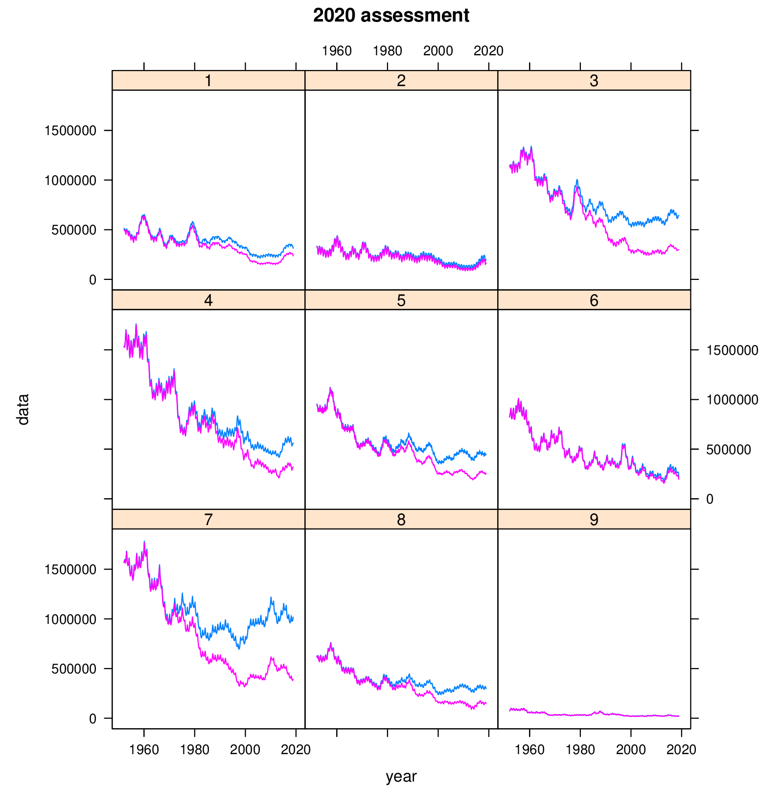

# Plots from Ongoing YFT Model Development

Plots of SB and SBF0:

```{r}
library(FLR4MFCL)
rep17 <- read.MFCLRep("c:/x/yft/2017/YFT_2017_basecase/plot-14.par.rep")
rep20 <- read.MFCLRep("c:/git/PacificCommunity/ofp-sam/yft-2020-runs/Grid_Models/diagnostic_matt/run/End/plot-10.par.rep")
xyplot(data~year|area, group=qname,
       data=FLQuants(qts(adultBiomass_nofish(rep20)), qts(adultBiomass(rep20))),
       type="l", as.table=TRUE, main="2020 assessment")
dev.new()
xyplot(data~year|area, group=qname,
       data=FLQuants(qts(adultBiomass_nofish(rep17)), qts(adultBiomass(rep17))),
       type="l", as.table=TRUE, main="2017 assessment")
```




Compared to the 2017 assessment, the 2020 assessment estimates that there is/was
substantial biomass in regions 5 and 6. These southern regions have always had
low catches.
